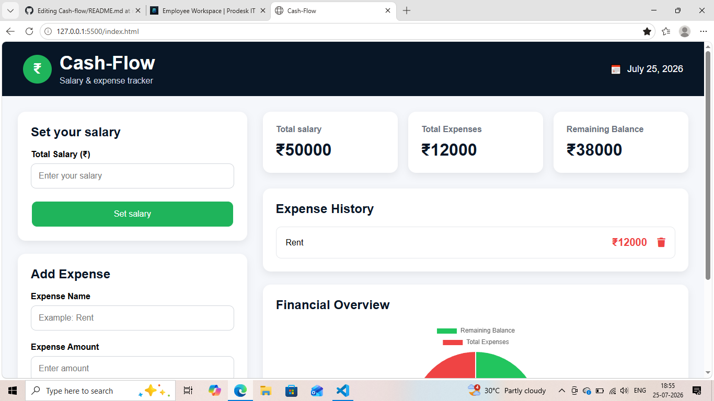
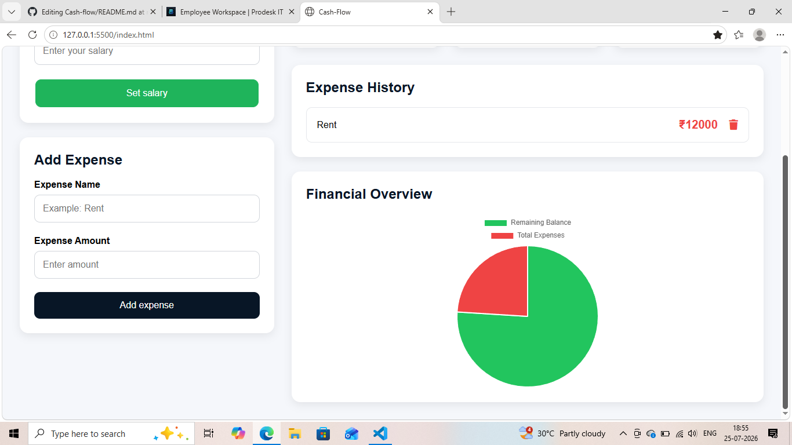

# Cash-flow

A Salary & Expense Tracker built using **HTML, CSS, and Vanilla JavaScript**. This application allows users to manage their salary, record expenses, calculate their remaining balance, visualize their finances with a pie chart, and persist data using LocalStorage.

---

## 📌 Project Overview

Cash-Flow is a simple personal finance dashboard that enables users to:

- Set their total salary.
- Add multiple expenses.
- View total salary, total expenses, and remaining balance.
- Delete expenses.
- Persist data across browser reloads using LocalStorage.
- Visualize financial data with a dynamic Chart.js Pie Chart.

---

## ✨ Features

### ✅ Salary Management
- Set and update total salary.
- Display salary in real time.

### ✅ Expense Management
- Add expenses with a name and amount.
- Display expenses dynamically.
- Delete individual expenses.

### ✅ Automatic Calculations
- Total Expenses
- Remaining Balance

Formula used:

```
Remaining Balance = Total Salary - Total Expenses
```

### ✅ LocalStorage Persistence
- Salary is saved in LocalStorage.
- Expenses are saved in LocalStorage.
- Data is automatically restored after refreshing the page.

### ✅ Data Visualization
- Dynamic Pie Chart using Chart.js.
- Displays:
  - Remaining Balance
  - Total Expenses

### ✅ Form Validation
- Prevents empty inputs.
- Prevents negative or zero values.
- Displays appropriate error messages.

---

## 🛠️ Technologies Used

- HTML5
- CSS3
- Vanilla JavaScript (ES6)
- LocalStorage API
- Chart.js
- Font Awesome

---

## 📂 Project Structure

```
Cash-Flow/
│
├── index.html
├── style.css
├── index.js
├── README.md
└── prompts.md
```

---

## 🚀 How to Run the Project

1. Clone the repository.

```
git clone <repository-url>
```

2. Open the project folder.

3. Open `index.html` in your browser.

No additional installation or build tools are required.

---

## 🧮 Application Workflow

1. Enter the total salary.
2. Click **Set Salary**.
3. Add expenses by entering:
   - Expense Name
   - Expense Amount
4. View:
   - Total Salary
   - Total Expenses
   - Remaining Balance
5. Delete expenses when required.
6. Refresh the browser to verify LocalStorage persistence.

---

## 📸 Application Features

- Responsive dashboard layout
- Salary input form
- Expense input form
- Summary cards
- Expense history
- Delete functionality
- Financial overview pie chart
- Persistent data storage

---

## 🎯 Learning Objectives

This project demonstrates understanding of:

- DOM Manipulation
- Event Handling
- Form Validation
- Arrays and Objects
- JavaScript Functions
- State Management
- LocalStorage
- Dynamic Rendering
- Chart.js Integration

  ##Screenshots
  
  

  ##Author
  Shahira sohail
  
##Project URL
https://cash-flow-theta-sage.vercel.app
